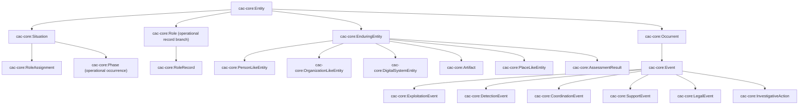
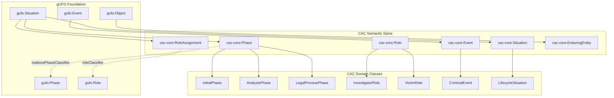
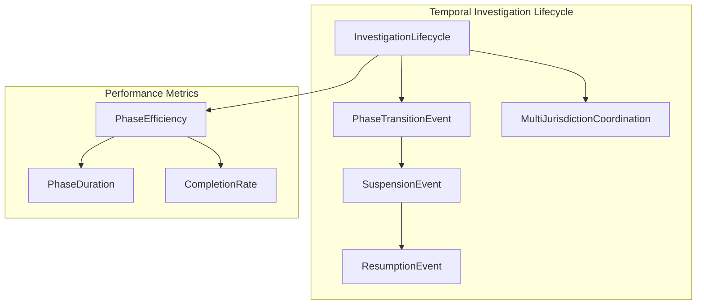
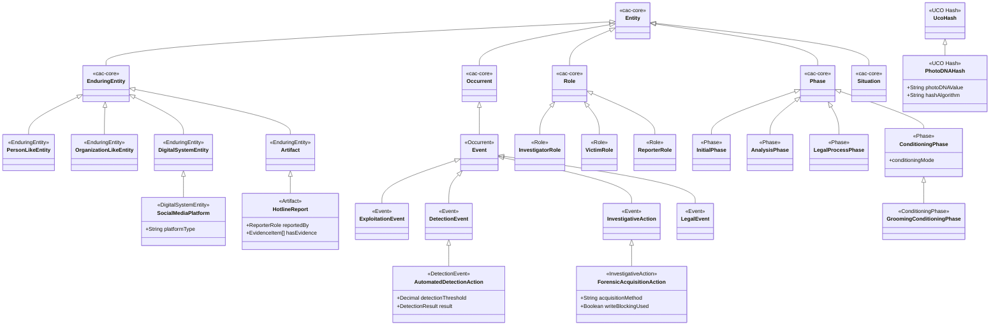

# CAC Ontology Family Architecture

> **Published baseline:** CAC Ontology **v3.1.0**. A local, unreleased v4 architecture proposal is documented in [v4-foundational-architecture.md](v4-foundational-architecture.md). CASE/UCO imports remain pinned to **1.5.0** in the proposal baseline.

## Semantic Spine Architecture

CAC Ontology v3.1.0 uses the **semantic spine** introduced in v3.0.0 — a stable, top-level class hierarchy rooted at `cac-core:Entity` and organized by ontological kind. The spine lives in `ontology/cacontology-core-spine.ttl` (with SHACL shapes in `ontology/cacontology-core-spine-shapes.ttl`) and serves three purposes:

1. **Anchoring domain modules** — domain classes are designed to subclass an appropriate spine branch, giving the family a coherent top-level taxonomy.
2. **Mediating external alignment** — bridge files map spine branches to gUFO, UCO, and CASE so that downstream consumers get foundational-ontology semantics without domain modules importing those external vocabularies directly.
3. **Providing a stable extension point** — new modules only need to pick the right spine branch; the bridges propagate alignment automatically.



### Spine-to-External Alignment (Bridges)

| Spine Branch | gUFO Alignment | UCO / CASE Alignment |
|---|---|---|
| `cac-core:EnduringEntity` | `gufo:Object` | `uco-core:UcoObject` |
| `cac-core:Event` | `gufo:Event` | `uco-action:Action` |
| `cac-core:Role` | No direct classifier alignment; operational record branch | — |
| `cac-core:RoleAssignment` | `gufo:TemporaryInstantiationSituation` | — |
| `cac-core:Phase` | No direct classifier alignment; operational occurrence under `gufo:Situation` | — |
| `cac-core:Situation` | `gufo:Situation` | — |
| `cac-core:Artifact` | `gufo:Object` | `uco-observable:ObservableObject` |
| `cac-core:PersonLikeEntity` | `gufo:Object` | `uco-identity:Person` |

These mappings are maintained in three dedicated bridge files: `cacontology-bridge-gufo.ttl`, `cacontology-bridge-uco.ttl`, and `cacontology-bridge-case.ttl`. In the v4 proposal, genuine `gufo:Role` and `gufo:Phase` classifiers are separate OWL classes connected to operational assignments or occurrences; they are not superclasses of `cac-core:Role` or `cac-core:Phase`.

---

## gUFO Foundational Ontology Integration

CAC v3.1.0 ships a semantic spine, gUFO bridge, temporal module, and integration-pattern module. The “phase” labels below are retained only to explain the historical implementation sequence:

### Core investigation modeling
**Shipped files**: `ontology/cacontology-bridge-gufo.ttl`, `ontology/cacontology-core-spine.ttl`



### Temporal framework
**Shipped file**: `ontology/cacontology-temporal.ttl`



### Integration patterns
**Shipped file**: `ontology/cacontology-integration-patterns.ttl`

The former phased rollout and 345-day timeline are historical planning context, not a current roadmap.

## Complete Import Chain

```mermaid
graph TD
    subgraph UCO/CASE
        UCO[UCO Core]
        CASE[CASE Investigation]
    end

    subgraph "Semantic Spine & Bridges"
        SPINE[cacontology-core-spine.ttl]
        SPINE_SHAPES[cacontology-core-spine-shapes.ttl]
        BRIDGE_GUFO[cacontology-bridge-gufo.ttl]
        BRIDGE_UCO[cacontology-bridge-uco.ttl]
        BRIDGE_CASE[cacontology-bridge-case.ttl]
    end

    subgraph "gUFO Foundation"
        GUFO[gUFO Core Concepts]
        TEMPORAL_GUFO[cacontology-temporal.ttl]
        STRATEGY_GUFO[cacontology-integration-patterns.ttl]
    end

    subgraph "CAC Core"
        CAC[cacontology-core.ttl]
        CAC_SHAPES[cacontology-core-shapes.ttl]
        HOTLINES[cacontology-hotlines.ttl]
        HOTLINES_SHAPES[cacontology-hotlines-shapes.ttl]
        NCMEC[cacontology-us-ncmec.ttl]
    end

    subgraph "International & Global"
        INTERNATIONAL[cacontology-international.ttl]
        TRAINING[cacontology-training.ttl]
        PREVENTION[cacontology-prevention.ttl]
        LEGAL[cacontology-legal-harmonization.ttl]
    end

    subgraph "High-Priority Criminal Activities"
        PRODUCTION[cacontology-production.ttl]
        CUSTODIAL[cacontology-custodial.ttl]
        GROOMING[cacontology-grooming.ttl]
        SEXTORTION[cacontology-sextortion.ttl]
        ATHLETIC[cacontology-athletic-exploitation.ttl]
    end

    subgraph "Specialized Investigation"
        UNDERCOVER[cacontology-undercover.ttl]
        PHYSICAL[cacontology-physical-evidence.ttl]
        TACTICAL[cacontology-tactical.ttl]
        MULTI_JURISDICTION[cacontology-multi-jurisdiction.ttl]
        STRANGER[cacontology-stranger-abduction.ttl]
    end

    subgraph "Technical Support"
        FORENSICS[cacontology-forensics.ttl]
        FORENSICS_SHAPES[cacontology-forensics-shapes.ttl]
        DETECTION[cacontology-detection.ttl]
        PLATFORMS[cacontology-platforms.ttl]
        STREET[cacontology-street-recruitment.ttl]
    end

    subgraph "Victim Services & Legal"
        VICTIM_IMPACT[cacontology-victim-impact.ttl]
        TASKFORCE[cacontology-taskforce.ttl]
        SENTENCING[cacontology-legal-outcomes.ttl]
        SPECIALIZED_UNITS[cacontology-specialized-units.ttl]
        SEX_OFFENDER[cacontology-sex-offender-registry.ttl]
    end

    subgraph Examples
        HOTLINE_EX[hotline-lifecycle.ttl]
        INVEST_EX[investigation-lifecycle.ttl]
        ENHANCED_EX[enhanced-investigation-lifecycle.ttl]
        DOUGLAS_EX[douglas-comprehensive-case.ttl]
        RHODE_ISLAND_EX[rhode-island-production-case.ttl]
        ARKANSAS_EX[arkansas-operation-cyber-highway-safety-check-example.ttl]
        REGISTRY_EX[sex-offender-registry-integration-example.ttl]
        ILLINOIS_EX[illinois-attorney-general-case-example.ttl]
        MORTON_EX[brooklyn-morton-october-2024-example.ttl]
        SEXTORTION_EX[wa-sextortion-case-example.ttl]
    end

    SPINE --> CAC
    CAC --> HOTLINES
    GUFO --> BRIDGE_GUFO
    GUFO --> TEMPORAL_GUFO
    GUFO --> STRATEGY_GUFO
    UCO --> BRIDGE_UCO
    CASE --> BRIDGE_CASE
    BRIDGE_GUFO --> SPINE
    BRIDGE_UCO --> SPINE
    BRIDGE_CASE --> SPINE
    SPINE -.-> SPINE_SHAPES
    CAC --> NCMEC
    
    CAC --> INTERNATIONAL
    CAC --> TRAINING
    CAC --> PREVENTION
    CAC --> LEGAL
    
    CAC --> PRODUCTION
    CAC --> CUSTODIAL
    CAC --> GROOMING
    CAC --> SEXTORTION
    CAC --> ATHLETIC
    
    CAC --> UNDERCOVER
    CAC --> PHYSICAL
    CAC --> TACTICAL
    CAC --> MULTI_JURISDICTION
    CAC --> STRANGER
    
    CAC --> FORENSICS
    CAC --> DETECTION
    CAC --> PLATFORMS
    CAC --> STREET
    
    CAC --> VICTIM_IMPACT
    CAC --> TASKFORCE
    CAC --> SENTENCING
    CAC --> SPECIALIZED_UNITS
    CAC --> SEX_OFFENDER

    HOTLINES -.-> HOTLINES_SHAPES
    CAC -.-> CAC_SHAPES
    FORENSICS -.-> FORENSICS_SHAPES
    
    style GUFO fill:#e1f5fe
    style BRIDGE_GUFO fill:#e1f5fe
    style BRIDGE_UCO fill:#e1f5fe
    style BRIDGE_CASE fill:#e1f5fe
    style TEMPORAL_GUFO fill:#e1f5fe
    style STRATEGY_GUFO fill:#e1f5fe
    style SPINE fill:#c8e6c9
    style SPINE_SHAPES fill:#c8e6c9
```



> **Note**: The semantic spine (green) provides the stable class hierarchy that all domain modules extend. Bridge files (blue) map spine branches to gUFO, UCO, and CASE. Shapes files (dotted lines) are used for validation but not imported by production graphs.

### Release Versioning Policy

- The CAC Ontology family uses a **global release version** recorded in `CHANGELOG.md` (currently `v3.1.0`) to describe the state of the full suite.
- Individual ontology modules (and their SHACL shapes) retain **module-specific `owl:versionIRI` values**, which are only incremented when that particular module’s semantics change.
- This approach avoids churn in ontology IRIs while still providing a clear project-wide release history for implementers and downstream tools.

## Enhanced Data Flow with gUFO Integration

```mermaid
graph LR
    subgraph Input
        JSON[JSON-LD Report]
        API[API Submission]
        FORM[Web Form]
        ESP[Platform ESP Reports]
        ATHLETIC_REPORT[Athletic Coaching Reports]
    end

    subgraph "gUFO-aligned processing"
        PHASE_MODEL[Phase Modeling]
        ROLE_VALID[Role Validation]
        TEMPORAL_CONST[Temporal Constraints]
        ANTI_RIGID[Anti-Rigid Validation]
    end

    subgraph "Detection & Classification"
        HASH[Hash Generation]
        ML[ML Detection]
        MANUAL[Manual Review]
        CLASS[Classification (SAR/COPINE)]
        ATHLETIC_ANALYSIS[Athletic Authority Analysis]
    end

    subgraph "Forensic Processing"
        ACQUIRE[Device Acquisition]
        VERIFY[Evidence Verification]
        CHAIN[Chain of Custody]
        RECOVER[File Recovery]
        TEAM_DYNAMICS[Team Dynamics Analysis]
    end

    subgraph "Platform Cooperation"
        PRESERVE[Data Preservation]
        DISCLOSE[Legal Disclosure]
        MODERATE[Content Moderation]
        INSTITUTIONAL[Institutional Coordination]
    end

    subgraph Storage
        VALID[SHACL + gUFO Validation]
        STORE[Fuseki Store]
    end

    subgraph Output
        CASE_EXPORT[CASE Export]
        SPARQL[Enhanced Analytics]
        REPORTS[Forensic Reports]
        VIZ[Visualization]
        GUFO_ANALYTICS[gUFO Analytics]
        AI_INSIGHTS[AI-Enhanced Insights]
    end

    JSON --> PHASE_MODEL
    API --> PHASE_MODEL
    FORM --> PHASE_MODEL
    ESP --> PHASE_MODEL
    ATHLETIC_REPORT --> ATHLETIC_ANALYSIS
    
    PHASE_MODEL --> ROLE_VALID
    ROLE_VALID --> TEMPORAL_CONST
    TEMPORAL_CONST --> ANTI_RIGID
    
    ANTI_RIGID --> HASH
    HASH --> ML
    ML --> MANUAL
    MANUAL --> CLASS
    ATHLETIC_ANALYSIS --> CLASS
    
    CLASS --> ACQUIRE
    ACQUIRE --> VERIFY
    VERIFY --> CHAIN
    CHAIN --> RECOVER
    RECOVER --> TEAM_DYNAMICS
    
    CLASS --> PRESERVE
    PRESERVE --> DISCLOSE
    DISCLOSE --> MODERATE
    MODERATE --> INSTITUTIONAL
    
    TEAM_DYNAMICS --> VALID
    CLASS --> VALID
    VALID --> STORE
    
    STORE --> CASE_EXPORT
    STORE --> SPARQL
    STORE --> REPORTS
    STORE --> VIZ
    STORE --> GUFO_ANALYTICS
    STORE --> AI_INSIGHTS

    style PHASE_MODEL fill:#e1f5fe
    style ROLE_VALID fill:#e1f5fe
    style TEMPORAL_CONST fill:#e1f5fe
    style ANTI_RIGID fill:#e1f5fe
    style GUFO_ANALYTICS fill:#e1f5fe
    style AI_INSIGHTS fill:#e1f5fe
```

> **Note**: This data-flow diagram is architectural guidance. It does not claim that CAC Ontology itself ships the depicted applications, APIs, store, or AI pipeline.

### Offense-trajectory phase modeling

ICAC state-machine graphs represent offense progression as `cac-core:Phase` instances linked by `cac-core:precedes`. The macro preparatory step between initial contact and exploitation is `cac-core:ConditioningPhase`, with grooming-module instances carrying both `cacontology-grooming:ConditioningPhase` and `cac-core:Phase` (spine and grooming SHACL shapes require both types). The dominant preparatory mechanism is recorded on the macro node via `cac-core:conditioningMode` (for example `deception`, `trust_rapport`, or `normalization`). Deprecated `TrustBuildingPhase` labels map to `ConditioningPhase` with an appropriate `conditioningMode`. Variant sub-stages (`SexualizationPhase`, `IsolationPhase`) model optional refinement nodes rather than substitutes for the macro ConditioningPhase instance. See `docs/glossary.md` (Offense-trajectory state machine) for authoring guidance.

## Class Hierarchy (Spine-Organized)

The spine branches serve as the primary organizing structure for all CAC domain classes. Every domain class ultimately traces back to `cac-core:Entity` through one of the five top-level branches.



## Enhanced Property Relationships

```mermaid
graph TD
    subgraph "Core Investigation"
        I[CACInvestigation]
        R[HotlineReport]
        E[EvidenceItem]
    end

    subgraph "Detection System"
        D[AutomatedDetectionAction]
        DR[DetectionResult]
        H[PhotoDNAHash]
        C[Classification (SAR/COPINE)]
    end

    subgraph "Forensic Analysis"
        FA[ForensicAcquisitionAction]
        FI[ForensicImage]
        RF[RecoveredFile]
        COC[ChainOfCustodyAction]
    end

    subgraph "Platform Context"
        P[SocialMediaPlatform]
        ESP[ElectronicServiceProvider]
        PA[DataPreservationAction]
    end

    I -->|hasReport| R
    R -->|hasEvidence| E
    E -->|detectedBy| D
    D -->|hasResult| DR
    D -->|generatesHash| H
    DR -->|hasClassification| C
    
    I -->|hasStep| FA
    FA -->|producesImage| FI
    FA -->|followedBy| COC
    FI -->|containsFiles| RF
    
    R -->|reportedVia| P
    P -->|operatedBy| ESP
    I -->|requestsPreservation| PA
    PA -->|performedBy| ESP
```

## Complete Ontology Module Reference

CAC v3.1.0 ships 50 ontology, spine, bridge, and integration Turtle modules plus 47 SHACL shape files. The selected module reference below is organized by domain; the complete inventory is in [CAC-Ontology-List](CAC-Ontology-List).

### Semantic Spine & Bridges (5 modules)
- **`cacontology-core-spine.ttl`:** Stable top-level class hierarchy (Entity → EnduringEntity, Occurrent, Role, Phase, Situation); includes `cac-core:ConditioningPhase`, `cac-core:conditioningMode`, and `cac-core:precedes` for offense-trajectory state machines
- **`cacontology-core-spine-shapes.ttl`:** SHACL validation for spine classes (including required `cac-core:Phase` dual typing on `ConditioningPhase` instances; validation fails when the spine phase type is absent)
- **`cacontology-bridge-gufo.ttl`:** Spine-to-gUFO alignment (EnduringEntity → gufo:Object, Event → gufo:Event, etc.)
- **`cacontology-bridge-uco.ttl`:** Spine-to-UCO alignment (EnduringEntity → uco-core:UcoObject, etc.)
- **`cacontology-bridge-case.ttl`:** Spine-to-CASE alignment

### Core Framework (3 modules)
- **`cacontology-core.ttl`:** Base investigation framework and lifecycles (imports `cacontology-core-spine.ttl`)
- **`cacontology-hotlines.ttl`:** Hotline operations and report management
- **`cacontology-us-ncmec.ttl`:** Enhanced NCMEC integration and tip analysis

### International Coordination & Global Frameworks (4 modules)
- **`cacontology-international.ttl`:** Global coordination & cross-border operations (120+ countries)
- **`cacontology-training.ttl`:** Professional development & capacity building (155,000+ professionals)
- **`cacontology-prevention.ttl`:** Prevention programs & education
- **`cacontology-legal-harmonization.ttl`:** International legal framework (196 countries analyzed)

### High-Priority Criminal Activities (5+ modules)
- **`cacontology-production.ttl`:** Child sexual abuse material production
- **`cacontology-custodial.ttl`:** Custodial relationships & positions of trust
- **`cacontology-grooming.ttl`:** Online grooming & enticement; `ConditioningPhase` grooming specialization; deprecated `TrustBuildingPhase`
- **`cacontology-sextortion.ttl`:** Sexual extortion incidents
- **`cacontology-athletic-exploitation.ttl`:** Athletic coaching exploitation

### Specialized Investigation Ontologies (5+ modules)
- **`cacontology-undercover.ttl`:** Undercover operations
- **`cacontology-physical-evidence.ttl`:** Physical evidence & procurement
- **`cacontology-tactical.ttl`:** Tactical law enforcement operations
- **`cacontology-multi-jurisdiction.ttl`:** Multi-jurisdictional operations
- **`cacontology-stranger-abduction.ttl`:** Stranger abduction patterns

### Technical Support Ontologies (4+ modules)
- **`cacontology-forensics.ttl`:** Digital forensics
- **`cacontology-detection.ttl`:** Content detection & classification
- **`cacontology-platforms.ttl`:** Technology platforms & service providers
- **`cacontology-street-recruitment.ttl`:** Street-based recruitment patterns

### Victim Services & Task Force Management (5+ modules)
- **`cacontology-victim-impact.ttl`:** Victim impact assessment & recovery
- **`cacontology-taskforce.ttl`:** CAC task force organization
- **`cacontology-legal-outcomes.ttl`:** Legal outcomes & sentencing
- **`cacontology-specialized-units.ttl`:** Specialized units & advanced capabilities
- **`cacontology-sex-offender-registry.ttl`:** Sex offender registry management

### Validation components
- **`cacontology-core-shapes.ttl`:** Core validation shapes
- **`cacontology-hotlines-shapes.ttl`:** Hotline validation shapes
- **`cacontology-forensics-shapes.ttl`:** Forensic validation shapes
- 47 SHACL shape files are shipped; coverage and constraint depth vary by module

## UCO/CASE Integration

CAC reuses UCO and CASE concepts where their semantics fit:

**UCO Reuse:**
- `uco-observable:File`, `uco-observable:Image` for evidence artifacts
- `uco-types:Hash` for cryptographic hashes
- `uco-tool:AnalyticTool` for forensic and detection tools
- `uco-action:Action` for all investigation actions
- `uco-identity:Organization` for service providers

**CASE Integration:**
- `case-investigation:Investigation` as base for `CACInvestigation`
- Alignment with CASE investigation concepts through the CASE bridge
- A basis for CASE-oriented export; consuming tools may still require mapping or configuration

## Context Files and API Integration

### JSON-LD contexts
Five contexts currently ship under `contexts/`, covering grooming, sextortion, platforms, legal outcomes, and state-machine extensions. Broader context coverage is a future requirement, not a shipped v3.1.0 capability.

### Example Data Sets (selected files)
- **`hotline-lifecycle.ttl`:** Basic hotline workflow
- **`investigation-lifecycle.ttl`:** Basic investigation workflow
- **`enhanced-investigation-lifecycle.ttl`:** Advanced investigation with forensics
- **`douglas-comprehensive-case.ttl`:** Multi-ontology integration example
- **`rhode-island-production-case.ttl`:** Production case example
- **`arkansas-operation-cyber-highway-safety-check-example.ttl`:** Large-scale seasonal operations
- **`sex-offender-registry-integration-example.ttl`:** Registry system integration
- **`illinois-attorney-general-case-example.ttl`:** State-level prosecution and multi-agency coordination
- **`utah-dominic-christensen-example.ttl`:** Utah recidivism, registry compliance, and NCMEC-driven investigation (introduced in v3.0.0)

### Analytics Queries (selected files)
- **`comprehensive-case-analytics.rq`:** Cross-ontology analytics
- **`find_platform_cooperation_analytics.rq`:** Platform cooperation metrics
- **`find_automated_reports.rq`:** Automated reporting analysis
- **`find_live_stream_incidents.rq`:** Live streaming detection
- **`find_unhandled_reports.rq`:** Report status monitoring
- **`find_rescue_chains.rq`:** Victim rescue tracking
- **`find_report_statistics.rq`:** Statistical analysis
- **`find_open_reports.rq`:** Active case monitoring
- **`find_duplicate_evidence.rq`:** Evidence deduplication
- **`find_cross_border_actions.rq`:** International coordination tracking
- **`find_rescue_statistics.rq`:** Rescue operation metrics
 - **`utah-dominic-christensen-analytics.rq`:** Utah recidivism and NCMEC/registry analytics (timeline, compliance, and victim-centric queries)

## Development and Validation

### Docker Environment
The project includes a complete Docker Compose environment with:
- Apache Jena Fuseki for triple store operations
- pySHACL for validation
- ROBOT for ontology processing
- Automated CI/CD validation pipeline

### Quality Assurance
The following are project requirements or targets, not v3.1.0 completion or benchmark claims:
- ≥ 95% SHACL coverage requirement for object & datatype properties
- Automated validation in CI/CD pipeline
- Performance benchmarks (Q1 query ≤ 500ms on 5M triples)
- Cross-reference validation between ontology modules

See [Glossary](glossary.md) for acronyms and key terms.
