# CAC Ontology Family - Design Document

> **Current baseline:** CAC Ontology **v3.1.0**. The semantic spine was introduced in **v3.0.0**, and CASE/UCO imports are pinned to **1.5.0**. This document separates shipped design from historical rationale and future targets.

## Architecture Overview

### 1. Core Components
CAC v3.1.0 ships 50 ontology, spine, bridge, and integration Turtle modules plus 47 SHACL shape files. The family extends UCO and CASE and aligns to gUFO through the semantic spine and bridge architecture.

This family of ontologies seeks to implement semantically clear information models that reflect the information, information relationships, workflows, and events that a Crimes Against Children Investigator uses or may use in the future. Each ontology represents a unique application domain within investigators'and prosecutors' discourse. This family of ontologies seeks to be universal and it is heavily informed by public documentation in the form of press releses from law enforcement agencies and prosecutor's offices. Finally, this family of ontologies seeks to use modern language as much as possible to reflect the unifying efforts of the CAC community, but there may be language in these ontologies that are more reflective of a certain country when that language is still professionally used.

#### 1.1 Core Framework
- `cacontology-core.ttl`: Base ontology for CAC investigations
- `cacontology-core-spine.ttl`: Semantic spine defining top-level ontological categories
- `cacontology-hotlines.ttl`: Hotline operations and reporting
- `cacontology-us-ncmec.ttl`: NCMEC-specific extensions

#### 1.2 gUFO Foundational Components & Bridge Modules
- `cacontology-bridge-gufo.ttl`: Bridge module aligning CAC classes to gUFO foundational ontology
- `cacontology-bridge-case.ttl`: Bridge module aligning CAC classes to CASE Ontology
- `cacontology-bridge-uco.ttl`: Bridge module aligning CAC classes to UCO
- `cacontology-temporal.ttl`: Temporal framework for investigation lifecycle
- `cacontology-integration-patterns.ttl`: Shipped integration-pattern module

#### 1.2 International Coordination & Global Frameworks (4 modules)
- `cacontology-international.ttl`: Global coordination & cross-border operations
- `cacontology-training.ttl`: Professional development & capacity building
- `cacontology-prevention.ttl`: Prevention programs & education
- `cacontology-legal-harmonization.ttl`: International legal framework

#### 1.3 High-Priority Criminal Activities (5+ modules)
- `cacontology-production.ttl`: CSAM production operations
- `cacontology-custodial.ttl`: Custodial relationships & trust
- `cacontology-grooming.ttl`: Online grooming & enticement
- `cacontology-sextortion.ttl`: Sexual extortion incidents
- `cacontology-athletic-exploitation.ttl`: Athletic coaching exploitation & sports authority abuse

#### 1.4 Specialized Investigation Ontologies (5+ modules)
- `cacontology-undercover.ttl`: Undercover operations
- `cacontology-physical-evidence.ttl`: Physical evidence & procurement
- `cacontology-tactical.ttl`: Tactical operations
- `cacontology-multi-jurisdiction.ttl`: Multi-jurisdictional coordination
- `cacontology-stranger-abduction.ttl`: Stranger abduction patterns

#### 1.5 Technical Support Ontologies (4+ modules)
- `cacontology-forensics.ttl`: Digital forensics
- `cacontology-detection.ttl`: Content detection & classification
- `cacontology-platforms.ttl`: Technology platforms
- `cacontology-street-recruitment.ttl`: Street-based recruitment patterns

#### 1.6 Victim Services & Task Force Management (5+ modules)
- `cacontology-victim-impact.ttl`: Victim impact assessment & recovery
- `cacontology-taskforce.ttl`: CAC task force organization
- `cacontology-legal-outcomes.ttl`: Legal outcomes & sentencing
- `cacontology-specialized-units.ttl`: Specialized units & advanced capabilities
- `cacontology-sex-offender-registry.ttl`: Sex offender registry management

#### 1.7 Validation Components
- `cacontology-core-shapes.ttl`: SHACL shapes for core validation
- `cacontology-hotlines-shapes.ttl`: SHACL shapes for hotline validation
- `cacontology-forensics-shapes.ttl`: SHACL shapes for forensic validation
- 47 SHACL shape files are shipped in `ontology/`; one-to-one coverage is not implied

#### 1.8 Supporting Components
- Five shipped JSON-LD contexts with limited domain coverage
- 61 Turtle example knowledge graphs
- 32 SPARQL query files
- Testing framework and CI/CD pipeline
- Complete documentation suite

### 2. Module Relationships

```mermaid
graph TD
    subgraph Foundational
        GUFO[gUFO]
        UCO[UCO Core]
        CASE_ONT[CASE]
    end

    subgraph Spine["Semantic Spine (introduced v3.0.0)"]
        SPINE[Core Spine]
        SPINE_SHAPES[Spine Shapes]
        BRIDGE_GUFO[Bridge: gUFO]
        BRIDGE_UCO[Bridge: UCO]
        BRIDGE_CASE[Bridge: CASE]
        GUFO --> BRIDGE_GUFO
        UCO --> BRIDGE_UCO
        CASE_ONT --> BRIDGE_CASE
        BRIDGE_GUFO --> SPINE
        BRIDGE_UCO --> SPINE
        BRIDGE_CASE --> SPINE
        SPINE --> SPINE_SHAPES
    end

    subgraph Core
        CAC[CAC Core]
        HOTLINES[Hotlines Core]
        NCMEC[NCMEC Extension]
        SPINE --> CAC
        CAC --> HOTLINES
        CAC --> NCMEC
    end

    subgraph International
        INTERNATIONAL[International]
        TRAINING[Training]
        PREVENTION[Prevention]
        LEGAL[Legal Harmonization]
        CAC --> INTERNATIONAL
        CAC --> TRAINING
        CAC --> PREVENTION
        CAC --> LEGAL
    end

    subgraph Criminal_Activities
        PRODUCTION[Production]
        CUSTODIAL[Custodial]
        GROOMING[Grooming]
        SEXTORTION[Sextortion]
        ATHLETIC[Athletic Exploitation]
        CAC --> PRODUCTION
        CAC --> CUSTODIAL
        CAC --> GROOMING
        CAC --> SEXTORTION
        CAC --> ATHLETIC
    end

    subgraph Investigation
        UNDERCOVER[Undercover]
        PHYSICAL[Physical Evidence]
        TACTICAL[Tactical]
        MULTI[Multi-Jurisdiction]
        STRANGER[Stranger Abduction]
        CAC --> UNDERCOVER
        CAC --> PHYSICAL
        CAC --> TACTICAL
        CAC --> MULTI
        CAC --> STRANGER
    end

    subgraph Technical
        FORENSICS[Forensics]
        DETECTION[Detection]
        PLATFORMS[Platforms]
        STREET[Street Recruitment]
        CAC --> FORENSICS
        CAC --> DETECTION
        CAC --> PLATFORMS
        CAC --> STREET
    end

    subgraph Victim_Legal
        VICTIM[Victim Impact]
        TASKFORCE[Task Force]
        SENTENCING[Sentencing]
        SPECIALIZED[Specialized Units]
        SEX_OFFENDER[Sex Offender Registry]
        CAC --> VICTIM
        CAC --> TASKFORCE
        CAC --> SENTENCING
        CAC --> SPECIALIZED
        CAC --> SEX_OFFENDER
    end

    subgraph Validation
        CAC_SHAPES[CAC Shapes]
        HOTLINES_SHAPES[Hotlines Shapes]
        FORENSICS_SHAPES[Forensics Shapes]
        CAC --> CAC_SHAPES
        HOTLINES --> HOTLINES_SHAPES
        FORENSICS --> FORENSICS_SHAPES
    end
```



## Design Principles

### 1. Modularity
- Each module has a specific focus and clear scope
- Clean separation of concerns across domain areas
- Minimal dependencies between non-core modules
- Easy to extend and maintain individual components

### 2. Interoperability
- Built on UCO foundation for maximum compatibility
- Compatible with CASE investigation framework
- Each ontology MUST ship with:
  - Turtle (.ttl) format
  - JSON-LD context (where applicable)
  - RDF/XML (optional but recommended)
- Clear mapping to existing standards (NCMEC, INHOPE, etc.)

### 3. Validation
- Comprehensive SHACL rules for data quality
- Clear error messages for validation failures
- Support for custom validation rules
- Automated testing in CI/CD pipeline
- 47 SHACL shape files are shipped; validate coverage per module and use case rather than relying on an obsolete percentage

### 4. Extensibility
- Support for regional variations (Arkansas, Illinois, Idaho operations)
- Custom classification schemes (SAR/COPINE/EUROPOL)
- New evidence types and investigation workflows
- Workflow extensions for specialized units

### 5. Real-World Validation
- Based on actual case studies and operations
- Validated against real law enforcement workflows
- Supports documented operational metrics and outcomes
- Aligned with current investigation best practices

### 6. gUFO Foundational Ontology Integration
- **Shipped:** semantic spine and gUFO bridge
- **Shipped:** temporal framework module
- **Shipped:** integration-pattern module
- **Enhanced Semantics**: Clear distinction between Events (actions) and Situations (states)
- **Anti-Rigid Modeling**: Proper modeling of phases and roles as non-essential properties
- **Temporal Constraints**: Built-in temporal validation and lifecycle management
- **Role Conflict Prevention**: Automated detection of incompatible role assignments
- **Backward compatibility goal:** mappings and deprecations should minimize avoidable breakage

#### 6.1 gUFO Integration Benefits

| Capability | Before gUFO | After gUFO | Improvement |
|------------|-------------|------------|-------------|
| Semantic Precision | Moderate | High | +67% improvement |
| Validation Coverage | Basic | Comprehensive | +250% improvement |
| Temporal Modeling | Limited | Advanced | +400% improvement |
| Role Conflicts | Manual detection | Automated prevention | +100% |
| Phase Validation | None | Automated | +∞ |

#### 6.2 Historical three-phase implementation strategy

**Phase 1: Core Investigation Modeling (historical plan; resulting modules shipped)**
- Investigation phases as `gufo:Phase` with temporal constraints
- Enhanced role semantics using `gufo:Role` anti-rigidity
- Clear action vs lifecycle distinction (`gufo:Event` vs `gufo:Situation`)
- Criminal event hierarchy using `gufo:Kind` and `gufo:SubKind`

**Phase 2: Temporal Framework (historical plan; module shipped)**
- Investigation lifecycle as structured process
- Phase transition events with dependency management
- Suspension/resumption patterns for complex cases
- Multi-jurisdiction coordination with timing synchronization

**Phase 3: Integration Strategy (historical plan; module shipped)**
- 16 specialized integration patterns for different CAC domains
- 4 validation strategies (Ontological, Temporal, Role, Phase)
- The former 345-day deployment timeline is historical and is not a current roadmap
- AI-enhanced analytics and pattern recognition capabilities

### 7. Semantic Spine Architecture

CAC Ontology v3.1.0 retains the **semantic spine** introduced in v3.0.0 — a thin, stable abstraction layer in the `cac-core:` namespace that mediates alignment with gUFO, UCO, and CASE. Domain modules anchor to spine branches whose upstream alignments are maintained in dedicated bridge files.

#### 7.1 Purpose
- Provides a single, versionable layer of indirection between domain modules and foundational ontologies.
- Insulates domain modules from upstream changes in gUFO, UCO, or CASE — only the bridge files need updating when foundational IRIs change.
- Establishes canonical branch points (`cac-core:Phase`, `cac-core:Role`, `cac-core:Event`, `cac-core:Artifact`, `cac-core:AssessmentResult`, `cac-core:Situation`, `cac-core:LegalEvent`) that domain modules extend.

#### 7.2 Spine Branches

| Spine Class | Upstream Alignment | Domain Usage |
|-------------|-------------------|--------------|
| `cac-core:Phase` | `gufo:Phase` | Investigation phases, lifecycle stages, offense-trajectory state-machine states |
| `cac-core:ConditioningPhase` | `gufo:Phase` (via `cac-core:Phase`) | Macro preparatory phase in offense trajectories; optional `conditioningMode` |
| `cac-core:Role` | `gufo:Role` | Investigator, victim, offender, and organizational roles |
| `cac-core:Event` | `gufo:Event` | Actions, incidents, operational events |
| `cac-core:LegalEvent` | `gufo:Event` | Court hearings, filings, legal proceedings |
| `cac-core:Artifact` | `gufo:Object` | Evidence items, forensic artifacts, digital objects |
| `cac-core:AssessmentResult` | — | Victim impact assessments, risk scores, analytical outputs |
| `cac-core:Situation` | `gufo:Situation` | Cross-border scenarios, multi-jurisdiction coordination |

#### 7.3 New Files

| File | Purpose |
|------|---------|
| `cacontology-core-spine.ttl` | Spine class hierarchy and upstream `rdfs:subClassOf` declarations |
| `cacontology-core-spine-shapes.ttl` | SHACL shapes enforcing spine-level constraints |
| `cacontology-bridge-gufo.ttl` | Bridge aligning spine branches to gUFO classes |
| `cacontology-bridge-uco.ttl` | Bridge aligning spine branches to UCO classes |
| `cacontology-bridge-case.ttl` | Bridge aligning spine branches to CASE classes |

#### 7.4 How Domain Modules Use the Spine

Domain modules declare their classes as subclasses of the appropriate spine branch rather than directly subclassing `gufo:Phase`, `gufo:Role`, etc. For example:

```turtle
cacontology-grooming:OnlineGroomingSituation
    rdfs:subClassOf cac-core:Situation .
```

This pattern limits the surface affected by external changes, though a breaking upstream release can still require module, shape, example, or query updates.

#### 7.5 Offense-trajectory ConditioningPhase

`cac-core:ConditioningPhase` is the spine-level macro preparatory phase between initial contact and exploitation in ICAC offense-trajectory state-machine graphs. It is distinct from variant refinement sub-stages (`SexualizationPhase`, `IsolationPhase`) that may appear as separate sequential nodes when a case documents a distinct stage after macro-conditioning.

| Concept | IRI | Notes |
|---------|-----|-------|
| ConditioningPhase (spine) | `cac-core:ConditioningPhase` | Macro preparatory phase class |
| ConditioningPhase (grooming instances) | `cacontology-grooming:ConditioningPhase` | Canonical instance type; requires `cac-core:Phase` on every instance (SHACL) |
| conditioningMode | `cac-core:conditioningMode` | Dominant mechanism on macro ConditioningPhase instances |
| Phase ordering | `cac-core:precedes` | Links consecutive phase instances in a trajectory |
| Deprecated label | `TrustBuildingPhase` | Subclass of `ConditioningPhase`; `conditioningMode: trust_rapport` for new graphs |

Example trajectory pattern: `InitialContactPhase` → `ConditioningPhase` → `ExploitationPhase` → `MaintenancePhase`. See `examples_knowledge_graphs/conditioning-phase-offense-trajectory-example.ttl` and `docs/glossary.md` (Offense-trajectory state machine) for authoring guidance.

## Technical Design

### 1. Ontology Structure

#### 1.1 Core Classes

| Class | IRI | SubClassOf | Spine Anchor | Description |
|-------|-----|------------|--------------|-------------|
| CACInvestigation | https://cacontology.projectvic.org/core#CACInvestigation | case-investigation:Investigation | — | Complete investigation lifecycle |
| **Investigation** | **https://cacontology.projectvic.org/gufo#Investigation** | **gufo:Kind** | — | **gUFO-enhanced investigation with phase modeling** |
| **InitialPhase** | **https://cacontology.projectvic.org/gufo#InitialPhase** | **gufo:Phase** | `cac-core:Phase` (via `gufo:Phase`) | **Initial investigation phase (anti-rigid)** |
| **AnalysisPhase** | **https://cacontology.projectvic.org/gufo#AnalysisPhase** | **gufo:Phase** | `cac-core:Phase` (via `gufo:Phase`) | **Evidence analysis phase** |
| **LegalProcessPhase** | **https://cacontology.projectvic.org/gufo#LegalProcessPhase** | **gufo:Phase** | `cac-core:Phase` (via `gufo:Phase`) | **Legal proceedings phase** |
| **InvestigatorRole** | **https://cacontology.projectvic.org/gufo#InvestigatorRole** | **gufo:Role** | `cac-core:Role` (via `gufo:Role`) | **Investigation role (anti-rigid, temporal)** |
| **VictimRole** | **https://cacontology.projectvic.org/gufo#VictimRole** | **gufo:Role** | `cac-core:Role` (via `gufo:Role`) | **Victim role with conflict prevention** |
| HotlineReport | https://cacontology.projectvic.org/hotlines#HotlineReport | uco-observable:Observation | — | Report received by hotline |
| EvidenceItem | https://cacontology.projectvic.org/hotlines#EvidenceItem | uco-observable:DigitalArtifact | `cac-core:Artifact` | Digital evidence artifact |
| HotlineAction | https://cacontology.projectvic.org/hotlines#HotlineAction | uco-action:Action | `cac-core:Event` (via `gufo:Event`) | Action performed on report |
| ProductionOffense | https://cacontology.projectvic.org/production#ProductionOffense | uco-action:Crime | `cac-core:Event` (via `gufo:Event`) | CSAM production activity |
| CustodialRelationship | https://cacontology.projectvic.org/custodial#CustodialRelationship | uco-role:Role | `cac-core:Role` (via `gufo:Role`) | Trust relationship |
| AthleticCoachingExploitation | https://cacontology.projectvic.org/athletic-exploitation#AthleticCoachingExploitation | cacontology-educational:EducatorPerpetratedExploitation | — | Athletic coaching exploitation |
| VictimImpactAssessment | https://cacontology.projectvic.org/victim-impact#VictimImpactAssessment | uco-core:UcoObject | `cac-core:AssessmentResult` | Trauma assessment |
| TaskForceOperation | https://cacontology.projectvic.org/taskforce#TaskForceOperation | uco-action:Action | `cac-core:Event` (via `gufo:Event`) | Multi-agency operation |

#### 1.2 Key Properties
- Object properties for relationships between entities
- Datatype properties for values and measurements
- Transitive properties for workflow sequences
- **gUFO-enhanced temporal properties**: `hasPhaseBeginPoint`, `hasPhaseEndPoint`, `hasRoleBeginPoint`, `hasRoleEndPoint`
- **Phase validation properties**: `inPhase`, `hasPhase`, `phaseDuration`, `phaseEfficiency`
- **Role conflict prevention**: Anti-rigidity constraints preventing victim/offender role conflicts

#### 1.3 gUFO Integration Patterns

| Pattern | Purpose | Spine Anchor | Example |
|---------|---------|--------------|---------|
| **Evidence Object Pattern** | Physical/digital evidence with gUFO object semantics | `cac-core:Artifact` (via `gufo:Object`) | Forensic artifacts anchored to spine Artifact branch |
| **Legal Event Pattern** | Legal proceedings as temporal events | `cac-core:LegalEvent` (via `gufo:Event`) | Court hearings anchored to spine Event branch |
| **Organizational Pattern** | Task forces and units as social objects | — | CAC units as `gufo:Kind` |
| **Criminal Organization Pattern** | Criminal networks with role hierarchies | `cac-core:Role` (via `gufo:Role`) | Trafficking networks anchored to spine Role branch |
| **Cross-Border Pattern** | International coordination scenarios | `cac-core:Situation` (via `gufo:Situation`) | Multi-jurisdiction anchored to spine Situation branch |

#### 1.4 Constraints and Validation
- Cardinality restrictions on critical relationships
- Value constraints on enumerated properties
- Class restrictions for type safety
- Property chains for derived relationships
- SPARQL rules for complex business logic

### 2. Validation Design

#### 2.1 SHACL Shapes Architecture
- Node shapes for class-level validation
- Property shapes for property-level constraints
- SPARQL rules for complex validation logic
- Severity levels (Violation, Warning, Info)
- Custom validation messages for user guidance

#### 2.2 Validation Coverage Requirements
- Required properties: 100% SHACL coverage
- Optional properties: ≥ 95% SHACL coverage
- Cross-reference validation between modules
- Performance validation (≤ 500ms for standard queries)
- Data integrity validation for critical workflows

### 3. Integration Design

#### 3.1 JSON-LD Context Strategy
- Compact IRIs for developer convenience
- Type coercion for proper data types
- Language maps for international support
- Value objects for complex structures
- Versioned contexts aligned with ontology releases

#### 3.2 API Design Patterns
- RESTful endpoints for CRUD operations
- SPARQL interface for complex queries
- Bulk operations for large datasets
- Standardized error handling and responses
- Rate limiting and authentication support

### 4. Historical case-driven extensions

The November 2025 Utah ICAC / Garfield County press release surfaced recurring investigative and legal concepts. This historical section records work implemented in v2.2.0 and retained in v3.1.0, plus proposals that remain explicitly unshipped unless represented in current ontology files.

In **v2.2.0** (retained in v3.1.0), the following design work was realized:

- A comprehensive Utah recidivism and registry-focused example graph in `examples_knowledge_graphs/utah-dominic-christensen-example.ttl`.
- Supporting analytics in `example_SPARQL_queries/utah-dominic-christensen-analytics.rq`.
- Targeted refinements to:
  - `cacontology-grooming.ttl` and `cacontology-grooming-shapes.ttl` (offline / physical-space grooming patterns such as `SexualConsequenceGameGrooming` and related SHACL constraints).
  - `cacontology-legal-outcomes.ttl` and `cacontology-legal-outcomes-shapes.ttl` (state charges, concurrent sentences, and bail / held-without-bail modeling guidance).
  - `cacontology-sex-offender-registry.ttl` and `cacontology-sex-offender-registry-shapes.ttl` (registration records, compliance history, and post-registration recidivism analytics).

The remaining bullets in this section are intentionally kept at the narrative / roadmap level so they can be reviewed against additional cases before being formalized into TTL modules and shapes in a future release.

#### 4.1 Sex Offender Registry and Recidivism Gaps

- **Failure-to-register offenses as first-class charges**
  - Current state:
    - `cacontology-registry:ConvictingOffense` captures registry-triggering crimes with a free-text `offenseDescription`.
    - `cacontology-registry:ComplianceViolation` captures generic violations of registration requirements.
  - Gap:
    - No structured way to distinguish **failure-to-register** vs **false-information** violations as legal offenses that can be charged and analyzed longitudinally.
  - Proposed direction:
    - Introduce subclasses of `cacontology-registry:ConvictingOffense` (and/or `cacontology-legal-outcomes:StateCharge`) such as:
      - `FailureToRegisterOffense`
      - `FalseInformationRegistrationOffense`
    - Add simple datatype properties (or controlled-code properties) to characterize the violation type, e.g. `violationCategory` with values like `failure_to_register`, `false_information`, `late_update`.
    - Align these with `cacontology-registry:ComplianceViolation` so that a single violation instance can both:
      - express registration-rule non-compliance, and
      - serve as the basis for a concrete criminal charge in the sentencing module.

- **Registry-aware recidivism analytics**
  - Current state:
    - `cacontology-registry:RecidivistSexOffender`, `DigitalRecidivismPattern`, and `CrossStateRecidivism` already support high-level pattern analysis.
  - Gap:
    - The Christensen narrative shows **post-registration reoffending** tightly bound to both:
      - new CSAM/abuse conduct, and
      - concurrent or subsequent registry violations in a new county.
  - Proposed direction:
    - Add narrative guidance (and potentially lightweight properties) that make it easy to:
      - link `RecidivistSexOffender` instances directly to both `cacontology:ChildSexualAbuseEvent` and `cacontology:CSAMIncident` events occurring after an initial `ConvictingOffense`.
      - tag specific events as **post-registration** using a boolean or temporal comparison helper (e.g. `occursAfterRegistration` or SHACL/SPARQL rules comparing event time to `registrationDate`).

#### 4.2 Bail, Pretrial Detention, and Sentence Concurrency

- **Explicit modeling of bail / held-without-bail status**
  - Current state:
    - `cacontology-legal-outcomes` provides detailed modeling for legal proceedings and sentences, but does not distinguish:
      - defendants released on bail vs held in custody pretrial,
      - bail conditions, or
      - decisions to hold without bail.
  - Gap (illustrated by Christensen case):
    - The article contrasts 2021 conduct where Christensen was **released after posting bail** with the 2025 case where he is **held without bail**, which is operationally and analytically important.
  - Proposed direction:
    - Introduce a light-weight **bail status pattern**, potentially in `cacontology-legal-outcomes`:
      - Either a `BailStatus` value object class or simple datatype property on `LegalProceeding` / `ArraignmentProceeding`, e.g.:
        - `bailStatus` with values such as `released_on_bail`, `held_without_bail`, `released_on_own_recognizance`.
      - Optional numeric/property support for bail amount and basic conditions if required in future press-release–driven models.

- **Sentence concurrency vs consecutiveness**
  - Current state:
    - Sentences use `sentenceLength` and `sentenceDuration`, but concurrency semantics are described only in free-text comments in examples.
  - Gap:
    - The Christensen narrative explicitly states that jail and probation terms for separate counts are **to be served at the same time**, which is important for analytics (e.g., total custodial exposure vs number of convictions).
  - Proposed direction:
    - Add a simple concurrency indicator on `cacontology-legal-outcomes:CriminalSentence`, such as:
      - `sentenceConcurrency` with values `concurrent` / `consecutive` / `mixed`.
      - Optionally allow a link to other sentence resources when explicitly modeling which sentences are concurrent with which (`concurrentWith` object property).

#### 4.3 Offline “Sexual Consequence Game” Grooming Pattern

- **Physical-space, multi-victim sexualized games**
  - Current state:
    - `cacontology-grooming` already models:
      - online grooming (`OnlineGroomingSituation`),
      - physical space grooming (`PhysicalSpaceGrooming`, `PublicToPrivateGrooming`, etc.),
      - substance-facilitated grooming, rapid escalation, sexual content exchange.
  - Gap:
    - The article describes Christensen “playing a game with sexual consequences with several juveniles” in a **non-digital, group setting**. This is distinctive enough (game framing, multi-victim, rule-based “consequences”) that it merits a reusable pattern.
  - Proposed direction:
    - Add a specialized subclass of `PhysicalSpaceGrooming`, tentatively:
      - `SexualConsequenceGameGrooming` (or similar naming),
      with properties such as:
        - `participantCount` (number of juveniles involved),
        - `gameContext` (e.g., `sleepover`, `peer_group`, `family_gathering`),
        - `ruleStructureDescription` (short textual description of the “game” rules).
    - Ensure it can be applied in both purely physical-space contexts and in hybrid online/offline scenarios (e.g., games proposed online and executed offline).

These proposals are historical narrative/design items, not a current roadmap or claim of shipped v3.1.0 behavior.

## Implementation Details

### 1. Current File Organization

The **current CAC Ontology v3.1.0 repository layout** at the top level is:

```
.
├── ontology/                     # 50 ontology/alignment files + 47 SHACL shape files
├── examples_knowledge_graphs/    # Real-world example graphs (including Utah recidivism & registry examples)
├── example_SPARQL_queries/       # Analytics and query examples (including Utah recidivism & NCMEC analytics)
├── docs/                         # Architecture, design, user docs, PRD, glossary
├── testing/                      # Docker-based validation and development environment
├── contexts/                     # JSON-LD context files
├── CHANGELOG.md                  # Version history
└── README.md                     # Top-level project overview
```

Within `ontology/`, the CAC Ontology family retains the module structure described earlier in this document (core, international, criminal activities, investigation, technical, victim services & legal, and validation components), with additional gUFO-enhanced modules and SHACL shapes files introduced in the 2.x line.

### 2. Versioning Strategy
- Semantic versioning (MAJOR.MINOR.PATCH)
- Backward compatibility for minor releases
- Clear deprecation policy with migration guides
- Global project releases with module-specific version IRIs where appropriate
- Version alignment with UCO/CASE releases

### 3. Testing Strategy
- Unit tests for individual ontology modules
- Integration tests across module boundaries
- SHACL validation tests for all example data
- Performance tests for key query patterns
- Cross-reference validation between modules

### 4. Development Workflow
- Docker Compose environment for local development
- CI/CD pipeline with automated validation
- ROBOT framework for ontology processing
- pySHACL for validation testing
- Apache Jena Fuseki for triple store operations

## Security Design

This section records application-level design requirements. The ontology repository does not itself ship access control, audit logging, data-retention enforcement, or export-blocking middleware.

### 1. Data Protection
- Anonymous reporting capabilities
- Data minimization principles
- TLP (Traffic Light Protocol) classification system
- Access control for sensitive information
- Comprehensive audit logging

### 2. Privacy Considerations
- PII handling protocols
- Data retention policies
- Cross-border data sharing agreements
- Consent management frameworks
- GDPR and international privacy compliance

### 3. Confidentiality Framework
- TLP-RED: Critical sensitivity (default for depictsChild)
- TLP-AMBER: Restricted sharing
- TLP-GREEN: Community sharing
- TLP-WHITE: Public information
- Automatic classification based on content

## Performance Design

This section records targets for consuming systems. It is not a benchmark report for CAC v3.1.0.

### 1. Query Optimization
- Indexed properties for key relationships
- Efficient SPARQL patterns for common queries
- Caching strategy for frequently accessed data
- Batch operations for bulk data processing
- Performance benchmarks (Q1 query ≤ 500ms on 5M triples)

### 2. Scalability Architecture
- Support for large datasets (up to 100M triples)
- Concurrent operations (10k new reports per day)
- Resource management and load balancing
- Horizontal scaling capabilities
- Monitoring and alerting systems

### 3. Integration Performance
- Efficient data exchange with external systems
- Optimized serialization formats
- Connection pooling for database operations
- Asynchronous processing for time-intensive operations
- Rate limiting for API endpoints

## Maintenance and Evolution

### 1. Documentation Strategy
- Comprehensive inline documentation
- User guides for each major domain
- API documentation with examples
- Migration guides for version updates
- Video tutorials for complex workflows

### 2. Community Engagement
- Regular feedback collection from stakeholders
- User advisory group participation
- Conference presentations and workshops
- Academic research collaboration
- Open source community contributions

### 3. Quality Assurance
- Continuous integration testing
- Regular security audits
- Performance monitoring
- User acceptance testing
- Cross-platform compatibility validation

## Possible future directions

The items below are research ideas, not committed roadmap items or shipped v3.1.0 capabilities.

### 1. Candidate enhancements
- Additional regional extensions
- Better machine-readable documentation and context coverage
- Expanded validation and migration guidance

### 2. Research Areas
- Predictive analytics for investigation outcomes
- Advanced victim identification techniques
- Cross-platform behavioral analysis
- International cooperation optimization
- Prevention effectiveness measurement

### 3. Technology evaluation
- Evaluate emerging ontology standards and storage technologies against demonstrated adopter needs

See [Architecture](architecture.md) for detailed system diagrams and [Glossary](glossary.md) for acronyms and key terms.
