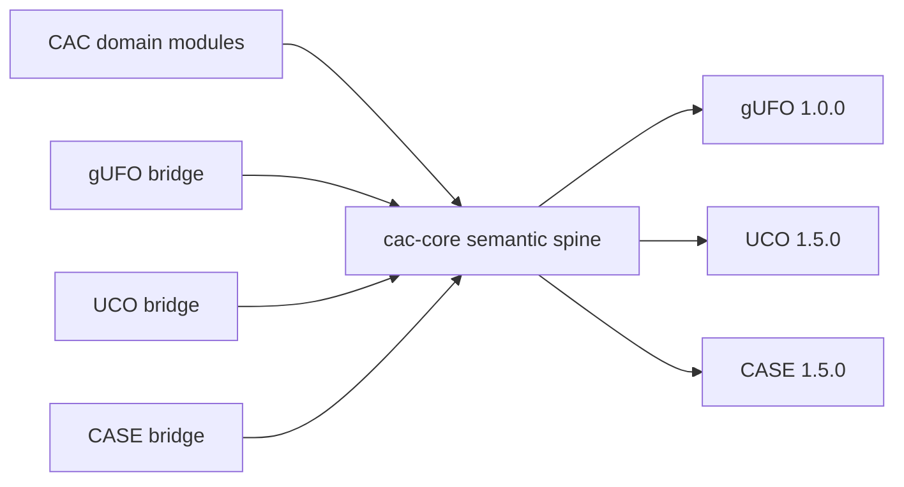

# Interoperability

CAC Ontology v3.1.0 extends the CASE, UCO, and gUFO ecosystems without replacing them. CASE and UCO imports are pinned to **1.5.0**, and gUFO imports are pinned to **1.0.0**.

## Ontology identity and versions

CAC uses stable, unversioned ontology document IRIs as the subjects of
`owl:Ontology` declarations. A release-specific `owl:versionIRI` identifies the
immutable release:

```turtle
<https://cacontology.projectvic.org> a owl:Ontology ;
    owl:versionIRI <https://cacontology.projectvic.org/3.1.0> ;
    owl:versionInfo "3.1.0" .
```

Individual term namespaces are also unversioned. Do not build class or property
IRIs from an ontology version IRI. External imports are intentionally different:
CAC pins CASE/UCO to their 1.5.0 version IRIs and gUFO to its 1.0.0 version IRI
for a reproducible import closure, while continuing to use stable term
namespaces.

## Alignment model

CAC domain classes first anchor to the semantic spine introduced in v3.0.0.
The v3.1 reference layer directly carries its established gUFO, UCO, and CASE
alignment axioms. Dedicated bridge modules document additional or legacy
alignments:



The shipped bridge files are:

- `ontology/cacontology-bridge-gufo.ttl`
- `ontology/cacontology-bridge-uco.ttl`
- `ontology/cacontology-bridge-case.ttl`

The direct gUFO dependency is part of CAC v3.1 semantics; it is not supplied by
UCO itself. The separate
[UCO gUFO Profile](https://github.com/ucoProject/UCO-Profile-gufo) is an
exploratory alignment ontology and is not imported by CAC v3.1. Importing both
CAC and that profile does not duplicate terms, but the profile adds stronger
alignment and disjointness axioms that can expose inconsistencies. Consumers
that opt into it should run OWL consistency checks over their complete graph.

Changing the Role/Phase alignment model or moving gUFO out of the reference
layer would alter existing entailments and is therefore reserved for a future
major release. CAC 3.1 version IRIs remain the compatibility target for
existing adopters.

## Authoring guidance

1. Use the most specific CAC domain class that matches the fact being represented.
2. Use a `cac-core:` class directly only when no appropriate domain class exists or when writing cross-domain tooling.
3. Do not add redundant CASE, UCO, or gUFO types merely to reproduce an inference already supplied by the ontology.
4. Load an additional bridge only when its documented legacy or extended alignment is needed; the v3.1 spine already contains its reference alignments.
5. Keep CASE/UCO dependencies at 1.5.0 and gUFO at 1.0.0 unless a future CAC release explicitly changes the pin.

## Serialization and validation

Turtle ontology and shapes files are the broadest shipped representations. JSON-LD context coverage is currently limited to six contexts under `contexts/`; do not assume one context per ontology module.

Validate data against the relevant SHACL files and test the actual import closure used by your application. Compatibility describes ontology alignment; it does not guarantee that every external tool can ingest every CAC graph without configuration.

## Integration tooling

The [CASE-UCO-SDK](https://github.com/vulnmaster/CASE-UCO-SDK) provides typed
graph builders and an MCP server that discovers CASE/UCO, CAC and other
extensions, upper-ontology profiles, modeling recipes, worked examples, and
source-specific mapping guidance. It can route investigation material, process
documents into bounded drafts, validate graphs with SHACL and concept coverage,
help create local extension ontologies, and prepare governed upstream change
proposals. Repository-specific AI-agent workflow, trust boundaries, version-skew
handling, and human approval requirements are defined in
[agent.md](../agent.md).
