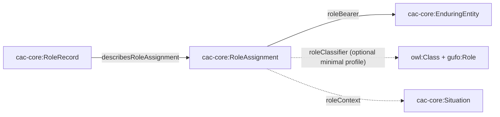

# v4 Foundational Architecture Proposal

> **Status:** Gate 3 local proposal under issue #44. This document does not announce a release and does not supersede the published v3.1.0 artifacts until maintainer approval.

## Decision

CAC operational data and gUFO classifier metamodel statements occupy different semantic levels. Version 4 must preserve that distinction instead of using one resource as both a case-data record or state occurrence and a `gufo:Role` or `gufo:Phase` classifier.

| Level | CAC construct | Meaning |
|---|---|---|
| Operational record | `cac-core:RoleRecord` | A source-facing record about a role assignment |
| Operational situation | `cac-core:RoleAssignment` | A contextual assignment connecting one bearer to an optional classifier |
| Classifier | `gufo:Role` | An OWL class describing a contingent type of enduring bearer |
| Operational occurrence | `cac-core:Phase` | A dated or ordered state/stage occurrence in case data |
| Classifier | `gufo:Phase` | An OWL class describing a contingent intrinsic type of an enduring entity |
| Operational state | `cacontology-custodial:CustodyState` | One occurrence in the history of a custodial relationship |
| Controlled concept | `cacontology-enterprises:MembershipTier` | A vocabulary concept referenced by a membership record |

## Role pattern

The minimal profile requires exactly one bearer. The rich profile additionally requires exactly one role classifier and one context. A role assignment or role record must never itself be typed `gufo:Role`.

## Phase-occurrence pattern

Repeated visits to the same conceptual phase are separate occurrence nodes. This preserves sequence, provenance, duration, and interruption history. A phase occurrence must never itself be typed `gufo:Phase`.

## Domain corrections

- Custodial relationships, temporary-custody arrangements, and emergency-custody arrangements are no longer phases. Their history is represented by `CustodyState` occurrences linked through `hasCustodyState`, `custodyStateOf`, and `currentCustodyState`.
- `MembershipTier` is a SKOS controlled concept. Referencing a tier does not make the tier an access-control system, hierarchy object, phase, or role.
- Operational role classes remain source-facing record classes. Genuine bearer classifiers use explicit, distinct classifier IRIs and an enduring bearer branch.
- Events and operational phase occurrences are disjoint modeling commitments; reviewed classes no longer inherit both branches.

## Compatibility boundary

Compatibility may preserve old identifiers only when the mapping is semantically safe. It must not restore any of these combinations:

- operational `cac-core:Role` with `gufo:Role`;
- operational `cac-core:Phase` with `gufo:Phase`;
- custodial relationship or arrangement with phase occurrence;
- membership tier with phase, role, or access-control object;
- event with phase occurrence.

Deprecated custody properties can forward to their state-oriented replacements. Historical role/phase conflation requires migration guidance rather than an equivalence axiom.

## Consumer contracts

- JSON-LD context: `contexts/cacontology-v4-foundation.jsonld`
- Role assignment query: `example_SPARQL_queries/v4-role-assignment.rq`
- Phase history query: `example_SPARQL_queries/v4-phase-history.rq`
- Custody-state query: `example_SPARQL_queries/v4-custody-state-history.rq`
- Membership-tier query: `example_SPARQL_queries/v4-membership-tier.rq`

## Conformance gates

1. Every Turtle artifact parses.
2. Every embedded SHACL `SELECT`, `ASK`, and `CONSTRUCT` query parses, except findings explicitly owned by unmerged PR #48.
3. The architecture diagnostic reports no asserted role/phase, enduring/phase, or event/phase level conflict.
4. Positive fixtures conform and negative level-mixing fixtures fail.
5. The 299-term disposition ledger contains no pending term.
6. Dependency and reasoner evidence states unresolved imports or unavailable engines explicitly; absence of evidence is never reported as conformance.

The proposal advances to release engineering only after Gate 4 maintainer approval.
